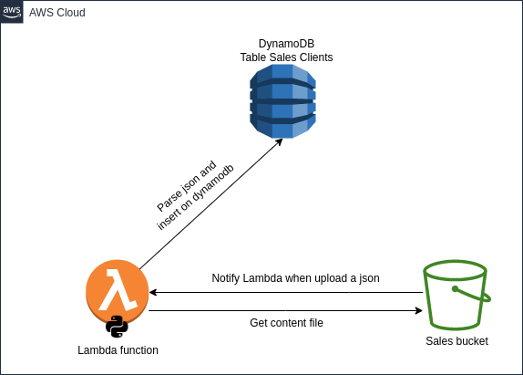

# nuwe-zurich-cloud-hackathon

## Description

This project is my participation in the [Nuwe Zurich Cloud Hackathon](https://nuwe.io/dev/competitions/zurich-cloud-hackathon/online-preselection-cloud-challenge)

These are the requirements of the hackathon:

1. Create a Lambda function that automates inserting data into DynamoDB.
2. Create Terraform files to automatically create all the necessary resources.
3. Automate the execution of the Lambda function to be triggered when uploading a JSON file to an s3 Bucket.
4. Create a short README with the infrastructure created and the decisions taken during the process.

## Infrastructure

This is a picture of the infrastructure we created with terraform.



The entire infrastructure is built with terraform and prepared to work with a `terraform apply`.

Some terraform modules have been used to set up the infrastructure, there is documentation for each module in the README.md inside each folder module.

IAM and S3 policies have been created for the role we use in the Lambda function.


## Python Lambda Function

The lambda function created we use boto3 to connect to amazon services, json to be able to parse the json uploaded in the sales clients bucket and os to be able to import the name of the table, we created a variable for it in the terraform.

The script is on `./files/src/lambda_function.py` and when apply terraform the src content folder is zipped to `./files/lambda/lambda.zip` 
## Requirements

Before using this code, make sure you have the following configured:

- [Terraform](https://www.terraform.io/downloads.html) installed.
- Configured AWS profile or you can [configure](https://registry.terraform.io/providers/hashicorp/aws/latest/docs#authentication-and-configuration) your preferred method.

## Usage

Follow these steps to use the Terraform code:

1. Clone this repository on your local machine.
2. Copy the `terraform.tfvars.dist` file to `terraform.tfvars` and adjust the configuration values to suit your needs.
3. Run the following command in the root directory of the project:

   ```shell
   terraform init
   ```

   This will initialise the Terraform backend and download the necessary plugins.

4. Review the resources that will be created with the following command:

   ```shell
   terraform plan
   ```

   This will show you a description of the resources that will be created. On total 11 resources.

5. Finally, run the following command to create the resources in AWS:

   ```shell
   terraform apply
   ```

   Confirm the execution by typing "yes" when prompted.

## Terraform files

The Terraform code is organised into the following files and directories:

- `main.tf`: This file contains the main Terraform configuration, including the AWS provider definition and the declaration of the modules used. Indlude all the resources, iam , s3, lambda and dynamodb.
- `versions.tf`: This file defines the providers used.
- `outputs.tf`: This file defines the outputs of the root module, which in this case there are none.
- `variables.tf`: This file defines the variables used in the code, AWS region and AWS profile.
- `modules/iam/role`: This directory contains the `iam/role` module, which is responsible for creating the IAM role with the associated trust policy for lambda service.
- `modules/iam/policy`: This directory contains the `iam/policy` module, which is responsible for creating a policy and attach it to a role.
- `modules/s3`: This directory contains the `s3` module, which is used to create the S3 bucket. It also creates the S3 policy and gives permissions to the created Lambda IAM role.
- `files`: This directory contains the folder for src and the lambda zip.
